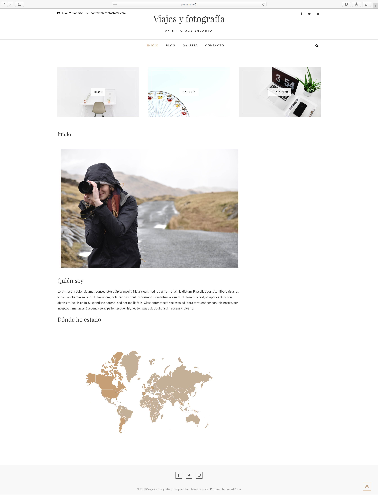
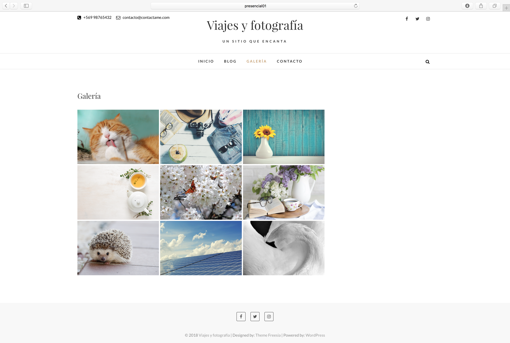
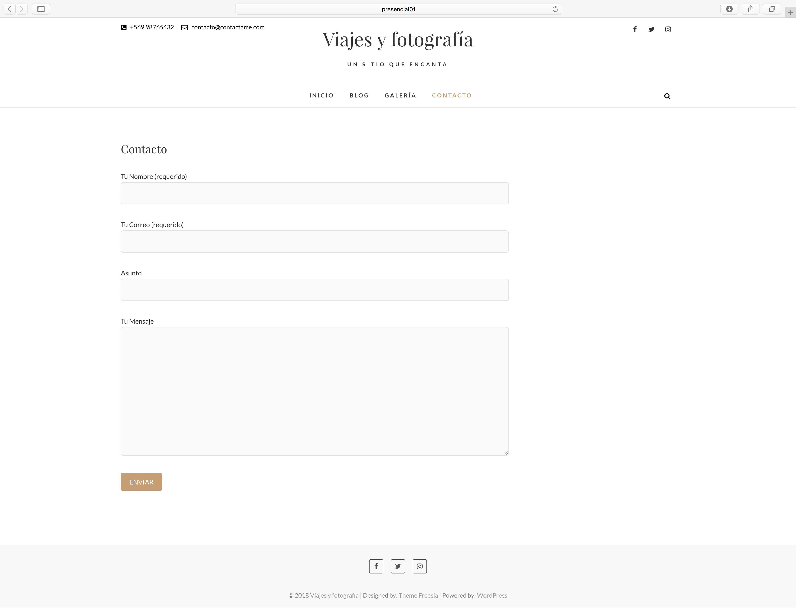
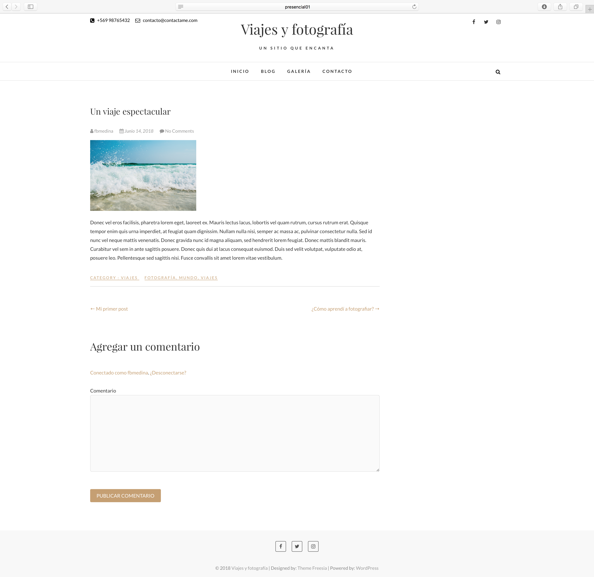

# Conociendo un tema de Wordpress


### INSTRUCCIONES:

- Para poder realizar este actividad debes haber realizado los cursos previo.
- Realiza tu trabajo y súbelos a tu repositorio de Github. En este caso es necesario que subas la carpeta wp-content y [base de datos con extensión .sql](https://cl.godaddy.com/help/exportar-mis-bases-de-datos-mysql-1487).
- Luego de pusheados los últimos cambios, sube el link de Github en el desafío de la sección correspondiente en la plataforma.

***

### DESCRIPCIÓN DE ACTIVIDAD

Una entusiasta fotógrafa viajera te pide que desarrolles su sitio web en Wordpress. Ella ya buscó entre los temas gratuitos de Wordpress y le gustó bastante el tema [Edge](https://es.wordpress.org/themes/edge/), por lo tanto tienes que usar ese tema.

Se necesita que realices las siguientes cuatro páginas en su sitio:

1. Página Inicio: Es la página por defecto, donde ella se presentará como fotógrafa y habrá un mapa de los países que ha visitado.
2. Página Blog: Donde se mostrarán las entradas que ella publicará respecto a sus viajes y al rubro de la fotografía.
3. Página Galería: Donde habrá una galería de nueve fotografías de ella.
4. Página Contacto: Donde habrá un formulario de contacto para contratar sus servicios.

##### **PÁGINA INICIO**

##### **PÁGINA BLOG**

##### **PÁGINA GALERÍA**

##### **PÁGINA CONTACTO**

Además, necesita que publiques 5 entradas con una imagen destacada y, por lo menos, un archivo multimedia en la descripción de la entrada. Éstas entradas deben tener una categoría, según su contenido, al igual que tener tres etiquetas diferentes asociadas al tema.

##### **ENTRADA DE EJEMPLO**

El menú de navegación de las páginas deben estar en el siguiente orden: **Inicio - Blog - Galería - Contacto**.

Es importante usar los botones de redes sociales que vienen en la plantilla y linkearlo con redes sociales reales.

### REQUERIMIENTOS

- El sitio debe tener instalado el tema [Edge](https://es.wordpress.org/themes/edge/).

- El sitio debe contener: cuatro páginas diferentes y cinco entradas.

- Las cuatro páginas deben ser: inicio, blog, galería y contacto.

- Todas las páginas deben tener una imagen destacada.

- La página inicio debe ser la página por defecto. Además debe tener una imagen en la descripción, un texto y un mapa del mundo con algunos países marcados.

- La página blog debe ser la contenedora de las entradas.

- La página galería debe tener una galería de nueve imágenes.

- La página de contacto debe tener un formulario.

- Las entradas deben contener una categoría y tres etiquetas cada una, además deben tener una imagen destacada y algún otro archivo multimedia en la descripción.

- Deben estar configuradas las redes sociales, un mail de contacto y un número de contacto en el header.

- Deben estar desactivados los Widgets laterales.

- La carpeta `wp-content` y [base de datos con extensión`.sql`](https://cl.godaddy.com/help/exportar-mis-bases-de-datos-mysql-1487) deben estar subidas a Github.

### RECURSOS

 - En el siguiente repositorio puedes encontrar las imágenes.

 - Esta es la [documentación del tema Edge](https://themefreesia.com/theme-instruction/edge/). Te ayudará bastante en la configuración de diseño y estructura.

Éxito, Vamos con todo!
